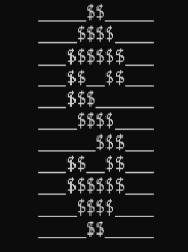
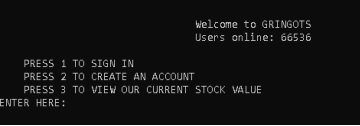
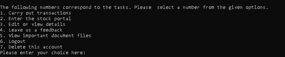

<!-- PROJECT LOGO -->
 

  

  <h2 align="center">Gringots</h2>
  <h3 align="center">The Banking Simulator</h3>
  <h5 align="center">$ Stock Management     $ Database Linking      $ Administrative mode</h5>

  

    <a href="https://github.com/Nitya-Pasrija/Gringots-Bank_Simulator">View Demo</a>
     
    <a href="https://drive.google.com/file/d/1vcm8MoYfaGdX1rQIYer--ApyaJVJX0zL/view?usp=sharing">Output Screens</a>
  

<!-- TABLE OF CONTENTS -->

  
Table of Contents

  <ol>
    <li>
      <a href="#about-the-project">About The Project</a>
      <ul>
        <li><a href="#built-with">Built With</a></li>
      </ul>
    </li>
    <li>
      <a href="#getting-started">Getting Started</a>
      <ul>
        <li><a href="#prerequisites">Prerequisites</a></li>
        <li><a href="#installation">Installation</a></li>
      </ul>
    </li>
    <li><a href="#usage">Usage</a></li>
    <li><a href="#license">License</a></li>
    <li><a href="#contact">Contact</a></li>
    <li><a href="#acknowledgments">Acknowledgments</a></li>
  </ol>

<!-- ABOUT THE PROJECT -->
## About The Project

The goal of this bank management project is to facilitate understanding 
of the front and back office operations of a bank, their interaction in a 
competitive environment, and to help cultivate holistic and fact-based 
management culture, develop analytical skills, and create awareness 
about the current banking operating environment.

The packages and modules used in the project are random, time, system 
and mysql.connector. The fluctuations in the stock value and the 
verification codes are generated using the functions in the random 
module. To make the project look realistic and dynamic, the time.sleep 
function has been put to use.

While running the project on command prompt, for better visuals the os 
module has been used to clear the screen, enabling the user to have an 
interactive programme that stimulates in them a real- world experience 
of a working bank.

The database of MySQL has been linked and controlled by the python 
commands using the mysql.connector module, this enables editing, 
entering and deleting data. This function has also helped generate 
queries and viewing them. Through this the users can not just view their 
details, edit them or get their balances updated but the administrator can 
create linked queries and fetch the required data accordingly

(<a href="#readme-top">back to top</a>)

### Built With

* Python
* MySQL

(<a href="#readme-top">back to top</a>)

<!-- GETTING STARTED -->
## Getting Started
Follow these steps to run it on your device. 

### Prerequisites

One should have PyCharm and MySQL installed beforehand.

### Installation

1. Clone the repo
   
2. Install Python MySQL connector 
   
3. Edit the Administrative Login Information in the __filename.py__ before running it on your desktop. 

4. Create a DataBase named ______ on your MySQL and then create a table using the following command:
*****code here for table creation

(<a href="#readme-top">back to top</a>)

<!-- USAGE EXAMPLES -->
## Usage

Here are a few Snips taken while the program was running for better understanding of the project :)

_For more examples, please refer to the [Documentation](https://drive.google.com/file/d/1vcm8MoYfaGdX1rQIYer--ApyaJVJX0zL/view?usp=sharing)_

(Highly recommended to visit this)

(<a href="#readme-top">back to top</a>)

<!-- LICENSE -->
## License

Distributed under the 3 Claused BSD License. 

(<a href="#readme-top">back to top</a>)

<!-- CONTACT -->
## Contact

Nitya Pasrija - [@NityaPasrija(Twitter)](https://twitter.com/NityaPasrija) - [LinkedIn](www.linkedin.com/in/nitya-pasrija)

Project Link: [https://github.com/your_username/repo_name](https://github.com/your_username/repo_name)

(<a href="#readme-top">back to top</a>)

<!-- ACKNOWLEDGMENTS -->
## Acknowledgments

* [Choose an Open Source License](https://choosealicense.com)
* [Template Documentation](https://github.com/othneildrew/Best-README-Template)

(<a href="#readme-top">back to top</a>)

